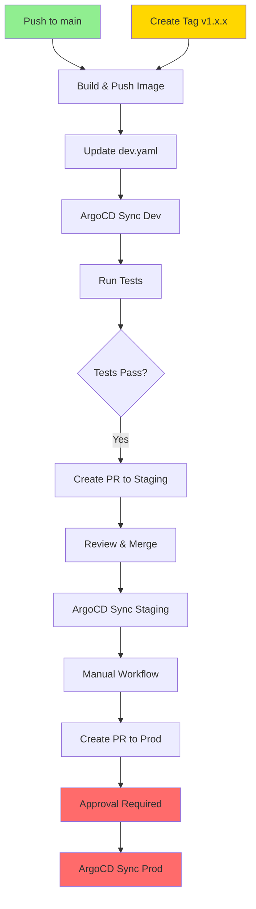

# GitOps CI/CD Architecture - E-Commerce Frontend

## 🎯 Arquitetura Implementada

Esta implementação segue as melhores práticas de **GitOps** e **Trunk-Based Development**:

- ✅ **Build Once**: Mesma imagem Docker (SHA) em todos os ambientes
- ✅ **Configuração Separada**: Helm values por ambiente (dev/staging/prod)
- ✅ **Promoção via PR**: Mudanças de versão através de Pull Requests
- ✅ **Automação Inteligente**: Dev automático, Staging via PR, Prod manual

## 📊 Fluxo de Deployment



## 🚀 Workflows Implementados

### 1. CI - Build and Deploy (`ci-build-and-deploy.yml`)

**Triggers:**
- Push para `main` → Deploy automático em **dev**
- Tag `v*.*.*` → Deploy em **dev** + PR para **staging**

**Jobs:**
1. **build-and-push**: Constrói e publica imagem Docker
2. **update-gitops-dev**: Atualiza `dev.yaml` automaticamente
3. **run-tests-dev**: Executa testes de smoke
4. **create-promotion-pr**: Cria PR para staging (apenas em tags)

### 2. Promote to Production (`promote-to-production.yml`)

**Trigger:** Manual (workflow_dispatch)

**Input:** Versão a ser promovida (ex: `v1.2.3`)

**Jobs:**
1. **validate-version**: Valida formato e existência da imagem
2. **create-production-pr**: Cria PR para produção com checklist

## 📁 Estrutura GitOps

```
infra-gitops/
└── apps/
    └── ecommerce-frontend/
        ├── appset.yaml          # ApplicationSet multi-ambiente
        └── values/
            ├── dev.yaml         # Atualizado automaticamente pelo CI
            ├── staging.yaml     # Atualizado via PR (após testes)
            └── prod.yaml        # Atualizado via PR manual
```

## 🔄 Cenários de Uso

### Cenário 1: Desenvolvimento Contínuo (Feature)

```bash
# 1. Desenvolver feature
git checkout -b feature/nova-funcionalidade
git commit -m "feat: adiciona nova funcionalidade"
git push origin feature/nova-funcionalidade

# 2. Merge para main
# PR aprovado e merged

# 3. CI automaticamente:
# - Builda imagem com tag main-abc123
# - Atualiza dev.yaml
# - ArgoCD deploya em dev
```

### Cenário 2: Release para Staging

```bash
# 1. Criar tag de release
git tag v1.2.0
git push origin v1.2.0

# 2. CI automaticamente:
# - Builda imagem com tag v1.2.0
# - Atualiza dev.yaml
# - Roda testes em dev
# - Cria PR para staging.yaml

# 3. Review e merge do PR
# - ArgoCD deploya v1.2.0 em staging
```

### Cenário 3: Promoção para Produção

```bash
# 1. Acionar workflow manual no GitHub
# Actions → Promote to Production → Run workflow
# Input: v1.2.0

# 2. Workflow cria PR para prod.yaml

# 3. Review rigoroso + Aprovação
# - Checklist de segurança
# - Plano de rollback
# - Merge do PR

# 4. ArgoCD deploya v1.2.0 em produção
```

## 🔐 Secrets Necessários

Configure no repositório do **e-commerce-frontend**:

```yaml
DOCKERHUB_USERNAME: seu-usuario
DOCKERHUB_TOKEN: seu-token
GITOPS_PAT: github-token-com-permissao-write
```

## 🎛️ Configuração por Ambiente

| Ambiente | Replicas | CPU/Memory | Ingress | Istio | Auto-Deploy |
|----------|----------|------------|---------|-------|-------------|
| **Dev** | 1-5 | 100m/100Mi | dev.* | ❌ | ✅ Automático |
| **Staging** | 2-10 | 200m/256Mi | staging.* | ❌ | 🔄 Via PR |
| **Prod** | 3-20 | 500m/512Mi | prod.* | ✅ | 🔴 Manual |

## 📝 Versionamento

Seguimos **Semantic Versioning**:

- `v1.0.0` → Release inicial
- `v1.1.0` → Nova feature
- `v1.1.1` → Bugfix
- `v2.0.0` → Breaking change

## 🔄 Rollback

### Rollback em Dev
```bash
# Reverter commit no infra-gitops
git revert <commit-hash>
git push
```

### Rollback em Staging/Prod
```bash
# Opção 1: Revert do PR
git revert <merge-commit>

# Opção 2: Atualizar manualmente
# Editar staging.yaml ou prod.yaml
# Criar PR com versão anterior
```

## 🧪 Testes

Adicione seus testes em `run-tests-dev` job:

```yaml
- name: Run smoke tests
  run: |
    # Health check
    curl -f https://dev.ecommerce.example.com/health
    
    # API tests
    npm run test:e2e
    
    # Performance tests
    k6 run tests/load.js
```

## 📊 Monitoramento

Após deploy, monitore:

- **ArgoCD**: Status de sincronização
- **Grafana**: Métricas de aplicação
- **Logs**: CloudWatch ou Loki
- **Traces**: OpenTelemetry + Tempo

## 🎯 Próximos Passos

1. ✅ Configurar secrets no GitHub
2. ✅ Ajustar URLs de ingress
3. ✅ Configurar certificados SSL (prod)
4. ✅ Implementar testes automatizados
5. ✅ Configurar alertas de deployment
6. ✅ Documentar runbook de rollback

## 🤝 Contribuindo

Para adicionar novos ambientes:

1. Criar `values/{ambiente}.yaml`
2. Adicionar entrada no `appset.yaml`
3. Atualizar workflows se necessário

---

**Arquitetura validada e pronta para produção! 🚀**
